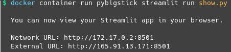

# pyBigstick

## Introduction
A python script that generates the input for [BIGSTICK](https://github.com/cwjsdsu/BigstickPublick) (Calvin, et al), which uses shell model (theory & algorithm) and fortran (implementation) to calculate the nuclear structure.

See main.py for the example code, and show.py for data visualization (using streamlit).
Note that [BIGSTICK](https://github.com/cwjsdsu/BigstickPublick) only supports unix-like system, so does pyBigstick.
But one can execute it using docker.

## Installation
```sh
$ cp -r clean_src src/   # Copy clean_src/ to src/
$ cd src/
$ make gfortran          # Use gfortran to compile bigstick. Feel free to use any other fortran compiler


# Check if compilation is successful, where bigstick.x is the executable
$ ls | grep bigstick.x

>> bigstick.x
```


## Run
```python
# Run pyBigstick calculating the nucleus
$ python3 main.py
```

```python
# Launch streamlit app for data visualization
$ streamlit run show.py
```


## Docker
Non unix-like system can use docker to visualize pyBigstick

1. Download docker
2. Build or download the pybigstick image

```sh
# Build an image by the dockerfile, taking ~ 5min
$ docker build -t pybigstick .

# Download the prebuilt image (https://hub.docker.com/r/noctildon/pybigstick)
$ docker pull noctildon/pybigstick
```

3. Launch the Streamlit app
```sh
$ docker container run noctildon/pybigstick streamlit run show.py
```
4. Open Network URL in the browser




To get full control of pybigstick, enter the pybigstick container with bash
```sh
$ docker container run -it noctildon/pybigstick bash
```


# Demo


<a title="Documents" href="https://github.com/noctildon/pyBigstick/blob/master/docs/content.md" target="_blank">Documents</a>


# Todos
- [ ] Provide different options of interaction files
- [ ] Find a lighter image (need suggestion)
- [ ] Deploy the whole app
- [x] Write documentation
- [x] use docker pack BIGSTICK fortran code along with streamlit